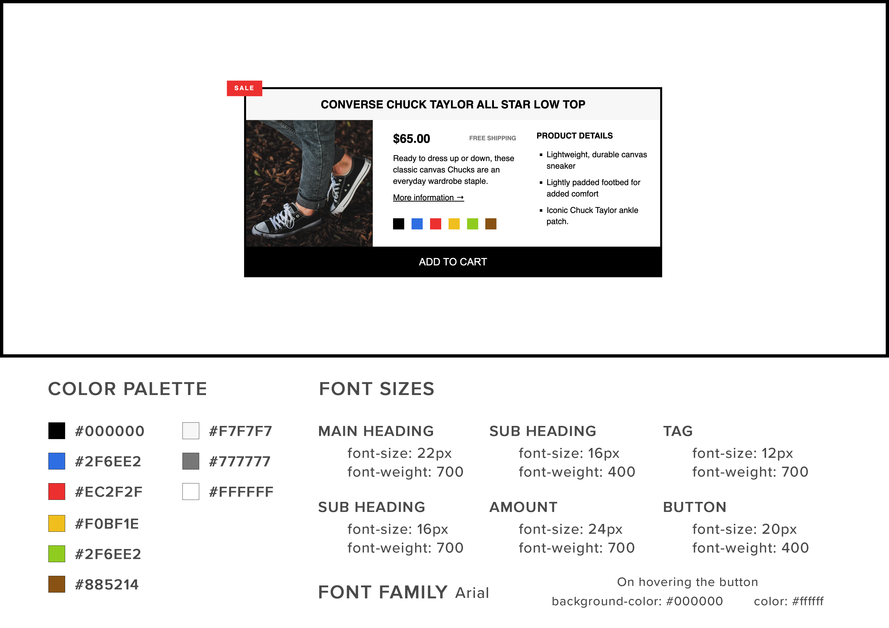

# Interview Challenge

Your goal is to recreate the design provided in the image within the repository, ensuring that the resulting web page closely matches the design in terms of layout, colors, fonts, and overall aesthetics. Additionally, your implementation should be responsive, adapting smoothly to different screen sizes.

## Data

The necessary data for this challenge can be accessed [here](./data/DATA.md)

## Preview

